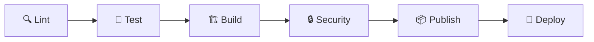
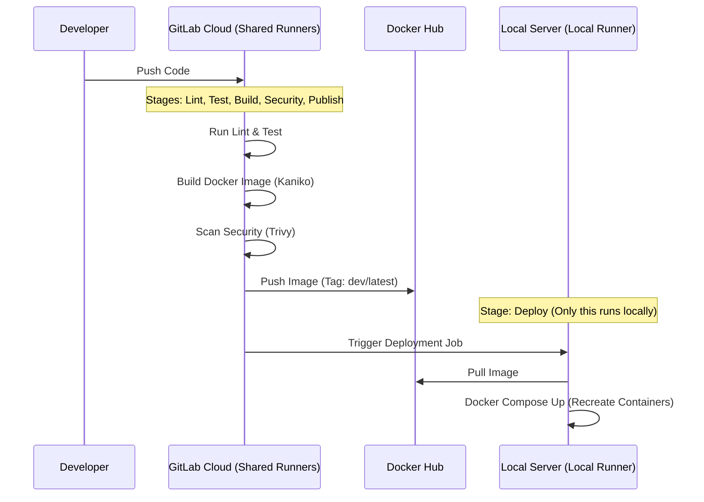

# GitLab CI/CD Pipeline — Walkthrough

## What Was Built

A **6-stage CI/CD pipeline** for the lakehouse-oss monorepo → Docker Hub → single VM (RHEL/CentOS).



## Files Created (11 total)

| File | Purpose |
|------|---------|
| [.gitlab-ci.yml](file:///c:/Workspace/RnD/lakehouse-oss/.gitlab-ci.yml) | Main pipeline: 6 stages, variables, workflow rules |
| [templates.yml](file:///c:/Workspace/RnD/lakehouse-oss/.gitlab/ci/templates.yml) | Kaniko build + SSH deploy templates |
| [lint.yml](file:///c:/Workspace/RnD/lakehouse-oss/.gitlab/ci/lint.yml) | Hadolint, Ruff, ShellCheck, yamllint |
| [test.yml](file:///c:/Workspace/RnD/lakehouse-oss/.gitlab/ci/test.yml) | Python tests, DAG import, Spark syntax, compose validation |
| [build.yml](file:///c:/Workspace/RnD/lakehouse-oss/.gitlab/ci/build.yml) | 28 Kaniko build jobs with per-service change detection |
| [security.yml](file:///c:/Workspace/RnD/lakehouse-oss/.gitlab/ci/security.yml) | SAST, Secret Detection, Trivy scanning |
| [publish.yml](file:///c:/Workspace/RnD/lakehouse-oss/.gitlab/ci/publish.yml) | Tag images with branch name + latest |
| [deploy.yml](file:///c:/Workspace/RnD/lakehouse-oss/.gitlab/ci/deploy.yml) | Deploy to single VM (auto from dev, manual from main) |
| [.hadolint.yaml](file:///c:/Workspace/RnD/lakehouse-oss/.hadolint.yaml) | Dockerfile linter config |
| [.ruff.toml](file:///c:/Workspace/RnD/lakehouse-oss/.ruff.toml) | Python linter config |
| [.env.example](file:///c:/Workspace/RnD/lakehouse-oss/.env.example) | Environment template (no real secrets) |

## Pipeline & Architecture Flow (Hybrid CI)

Hệ thống sử dụng mô hình **Hybrid CI** để vượt qua rào cản mạng nội bộ (Local Network) mà vẫn tận dụng sức mạnh của Cloud.

### 1. Luồng xử lý (Flow)


### 2. Chi tiết các Stage

| Stage | Chạy ở đâu? | Nhiệm vụ |
|-------|-------------|----------|
| **Lint & Test** | **GitLab Cloud** | Kiểm tra lỗi cú pháp code (Python, YAML, Dockerfile). |
| **Build** | **GitLab Cloud** | Dùng Kaniko build image, chỉ build service có thay đổi (tiết kiệm thời gian). |
| **Security** | **GitLab Cloud** | Quét lỗ hổng bảo mật trong code và image. |
| **Publish** | **GitLab Cloud** | Đẩy image đã build lên Docker Hub. |
| **Deploy** | **Local VM** | Runner tại máy chủ tự động "kéo" image mới về và cập nhật container. |

### 3. Quy tắc Branch (Branching Strategy)
- **`dev`**: Tự động Deploy ra môi trường (cập nhật liên tục).
- **`main`**: Cần nhấn nút **Manual Approval** mới Deploy (dành cho bản ổn định).


## How to Configure

### 1. GitLab CI/CD Variables (Settings → CI/CD → Variables)

| Variable | Value | Masked |
|----------|-------|--------|
| `DOCKERHUB_USERNAME` | Docker Hub username | ❌ |
| `DOCKERHUB_TOKEN` | Docker Hub access token | ✅ |
| `DEPLOY_SSH_KEY` | SSH private key (PEM) | ❌ (Không thể Mask vì có xuống dòng) |
| `DEPLOY_USER` | SSH user on VM (e.g. `root`) | ❌ |
| `DEPLOY_HOST` | VM IP address | ❌ |
| `DEPLOY_PATH` | e.g. `/opt/lakehouse-oss` | ❌ |

> [!IMPORTANT]
> **Lưu ý về `DEPLOY_SSH_KEY`**: 
> GitLab không cho phép "Mask" biến này vì nó chứa khoảng trắng và xuống dòng. Bạn hãy **BỎ TICK** "Mask variable" khi thêm biến này. Chỉ cần tick **Protect variable** là đủ an toàn (key chỉ xuất hiện trên branch protected như `dev` và `main`).

### 2. VM Setup (RHEL/CentOS)

```bash
# Cài Docker trên RHEL/CentOS
sudo dnf install -y dnf-plugins-core
sudo dnf config-manager --add-repo https://download.docker.com/linux/rhel/docker-ce.repo
sudo dnf install -y docker-ce docker-ce-cli containerd.io docker-compose-plugin

# Khởi động Docker
sudo systemctl start docker
sudo systemctl enable docker

# Nếu dùng CentOS (thay vì RHEL):
# sudo yum install -y yum-utils
# sudo yum-config-manager --add-repo https://download.docker.com/linux/centos/docker-ce.repo
# sudo yum install -y docker-ce docker-ce-cli containerd.io docker-compose-plugin

# Tạo thư mục deploy
sudo mkdir -p /opt/lakehouse-oss
sudo chown $USER:$USER /opt/lakehouse-oss

# Thêm SSH public key của CI runner
echo "ssh-rsa AAAA..." >> ~/.ssh/authorized_keys

# Kiểm tra
docker --version
docker compose version
```

### 3. Cài đặt GitLab Runner (Cho Local Network)

Vì Server của bạn nằm trong mạng nội bộ, bạn cần cài đặt **GitLab Runner** trực tiếp trên VM:

**BƯỚC 1: Lấy Registration Token**
1. Trên GitLab, vào **Settings → CI/CD → Runners**.
2. Nhấn **New project runner**.
3. Chọn **Linux**, nhập Tag là `lakehouse-local`. Nhấn **Create runner**.
4. Copy mã **Registration Token** (hoặc lệnh đăng ký).

**BƯỚC 2: Cài đặt trên VM (RHEL/CentOS) - Từ file RPM đã tải**

Bạn đã copy 2 file RPM vào thư mục `/opt/lakehouse-oss`. Hãy chạy lệnh sau:

```bash
cd /opt/lakehouse-oss

# 1. Cài đặt file helper-images TRƯỚC
sudo rpm -i gitlab-runner-helper-images_amd64.rpm

# 2. Sau đó mới cài đặt gitlab-runner
sudo rpm -i gitlab-runner_amd64.rpm

# 3. Đăng ký Runner (Chạy bằng user root)
sudo gitlab-runner register \
  --non-interactive \
  --url "https://gitlab.com/" \
  --registration-token "<TOKEN>" \
  --executor "shell" \
  --description "Local VM Runner" \
  --tag-list "lakehouse-local" \
  --run-untagged="false" \
  --locked="false"

# 4. Cài đặt và chạy service bằng user root
# (Không cần usermod vì root có full quyền Docker)
sudo gitlab-runner install --user=root --working-directory=/root
sudo gitlab-runner start
```

## Key Design Decisions

- **Hybrid CI**: 
  - **Cloud Build**: Lint, Test, Build, Publish chạy trên Shared Runners của GitLab (tiết kiệm tài nguyên VM).
  - **Local Deploy**: Chỉ stage `deploy` chạy trên **Local Runner** (có quyền truy cập trực tiếp vào Docker trên máy chủ).
- **Security**: Không cần mở port SSH, không cần IP Public. Runner tự kết nối ra ngoài để nhận lệnh.
